[linkedin](https://www.linkedin.com/in/DevNishantHub/) &nbsp;·&nbsp;
[github](https://github.com/DevNishantHub) &nbsp;·&nbsp;
[email](mailto:your@email.com)

> CS student based in Gurugram, India. 
> Build things that solve real problems, not just look good.

I ship fast, validate with real users, and cut what doesn't work. Right now that's 
[WantAnIdea](https://github.com/DevNishantHub/WantAnIdea) — crowdsourced project ideas with cognitive psychology to fight choice overload. Also 
building automation tools: async Python services, result monitoring, intelligent deduplication.

<samp>python &nbsp; javascript &nbsp; typescript &nbsp; react &nbsp; tailwind &nbsp; node &nbsp; fastapi &nbsp; postgres &nbsp; docker &nbsp; git &nbsp; linux</samp>

**[WantAnIdea](https://github.com/DevNishantHub/WantAnIdea)** &nbsp;·&nbsp; <samp>react, tailwind</samp> 
Crowdsourced project ideas platform with cognitive psychology principles. 
Smart filters, social proof, collaboration features. Fights choice overload. Open-source.

**[IPUScout](https://github.com/DevNishantHub/IPUScout)** &nbsp;·&nbsp; <samp>python</samp> 
Async Python service that monitors and auto-downloads exam result PDFs 
from GGSIPU. Real-time detection, continuous monitoring, intelligent deduplication.

Every graphic here is generated, not embedded from anyone else's server. 
The stat graphics and section headings are drawn by [a scheduled action](.github/workflows/stats.yml) 
straight from the GitHub GraphQL API, once a day, committing only what changed.

They animate with SMIL inside the SVG, because GitHub strips scripts from 
READMEs — and since nothing loads from a third party, nothing here can 
rate-limit or go dark. The headings are SVGs for the same reason: GitHub also 
strips CSS, so an image is the only way to put this page's own typeface on them.

The typeface is [JetBrains Mono](scripts/fonts), subset to just the characters 
each graphic draws and inlined as base64. Language totals cover public repositories only.
